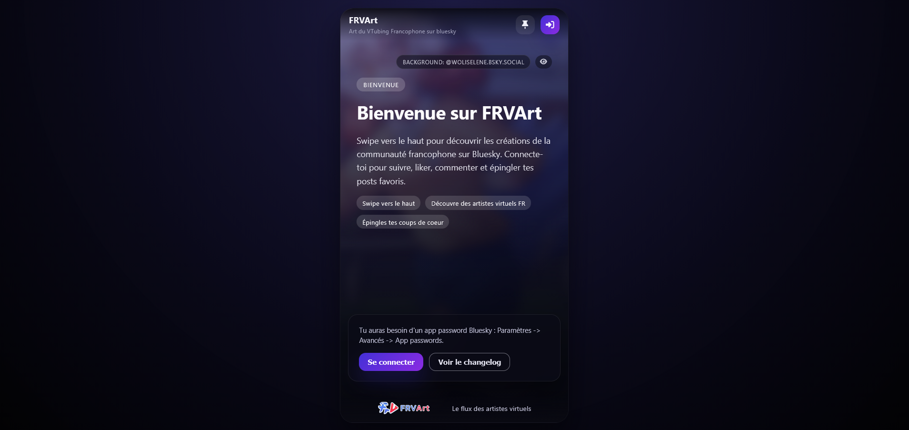

# FRV Music



[:computer: Releases](https://github.com/jojo58fr/FRVMusic/releases) | [:bug: Report an issue](https://github.com/jojo58fr/FRVMusic/issues)

FRV Music est une application React + TypeScript (Vite) pensée comme un Spotify-like 100 % front-end pour les VTubers & Vsingers francophones. L’interface charge un catalogue local (`data/artists.json` & `data/tracks.json`), propose les pages principales (Home, Artist, Playlist, Search), une barre lecteur persistante (audio/YouTube) et sauvegarde les préférences utilisateur en `localStorage`. Le projet est structuré pour évoluer vers une PWA ou un wrapper desktop.

## Version
- Version actuelle : **DEV** (// 2025). Voir [CHANGELOG.md](CHANGELOG.md) pour la liste complète des évolutions.

## Fonctionnalites principales

- UI responsive inspirée de Spotify (sidebar, contenu central, player bar)
- Lecture audio/YouTube avec file d'attente, favoris et gestion du volume
- Récupération des métadonnées YouTube via l’API Data v3 (`gapi-script`)
- State global géré par Zustand (`libraryStore`, `playerStore`, `userStore`)
- Données catalogue statiques pour un usage offline
- Thèmes clair/sombre synchronisés sur l’attribut `data-theme`
- Métadonnées prêtes pour une PWA (`public/manifest.json`)
- Documentation open source (`README`, `CONTRIBUTING`)
- Changelog integre, maintenant genere automatiquement depuis `CHANGELOG.md`.

## Installation

```bash
# Installation des dépendances
npm install

# Copie de l'exemple d'environnement puis ajout de votre clé API YouTube
cp .env.example .env

# Démarrage du serveur de dev (http://localhost:5173)
npm run dev

# Vérification TypeScript + build de prod
npm run build
```

## Prerequis
- Node.js 20+ (recommandé ou 18 LTS) et npm 9+.
- Un clé API Google pour faire des appels à youtube

## Configuration YouTube API

1. Crée une clé d’API sur la [Google Cloud Console](https://console.cloud.google.com/).
2. Active l’API **YouTube Data v3** pour ton projet.
3. Ajoute la clé dans un fichier `.env.local` à la racine :

   ```env
   VITE_YOUTUBE_API_KEY=ta_clé_api
   ```

4. Redémarre `npm run dev`. Les appels à l'API Google fonctionneront.


## Architecture

- **LibraryStore** : hydrate les artistes/morceaux statiques, expose les helpers de recherche.
- **PlayerStore** : gère la queue, la progression, l’état de lecture et les actions (play/pause/next/prev).
- **UserStore** (persisté) : playlists personnalisées, favoris, volume, thème, dernier morceau.
- **Components** :
  - `Sidebar` : navigation, gestion rapide des playlists.
  - `PlayerBar` : contrôles audio + intégration YouTube (via `react-player`).
  - `TrackList` & `ArtistCard` : listes stylées avec actions (favoris, ajout à playlist).
  - `TopBar` : recherche globale + switch thème clair/sombre.

## Catalogue

Les fichiers `src/data/artists.json` et `src/data/tracks.json` contiennent les métadonnées. Chaque piste suit ce schéma :

```jsonc
{
  "id": "kira-lumi-solar-ride",
  "title": "Solar Ride",
  "artistId": "kira-lumi",
  "duration": 203,
  "sources": { "youtubeId": "oHg5SJYRHA0", "audioUrl": null },
  "tags": ["edm", "original"]
}
```

Ajoute librement de nouveaux artistes/morceaux : la librairie se met à jour automatiquement.

## Thèmes & design system

- Variables CSS définies dans `src/styles/theme.scss`, appliquées via `data-theme="light|dark"`.
- `TopBar` expose le toggle. La préférence est persistée (Zustand + `localStorage`).
- SCSS global (`styles/global.scss`) pour la grille, typographie et scrollbars.

## Préparation PWA 📱

- `public/manifest.json` : métadonnées de l’app (nom, couleurs, icône vectorielle).
- `index.html` : liens vers le manifeste, favicon et meta `theme-color`.
- Prochaine étape : brancher Vite PWA plugin, service worker, offline caching.

## Lancement en developpement
```bash
npm run dev
```
Le serveur Vite affiche l'URL locale dans la console (par defaut http://localhost:5173).

## Build de production
```bash
npm run build
npm run preview
```

## Scripts npm utiles
- `npm run dev` : lance Vite en mode developpement.
- `npm run build` : compile TypeScript et genere les assets de production.
- `npm run preview` : previsualise le build de production.
- `npm run lint` : execute ESLint sur l'ensemble du projet.

## Organisation du projet

```
frvmusic/
├─ public/
│  ├─ icons/icon.svg          # Icône principale + manifeste PWA
│  └─ manifest.json
├─ src/
│  ├─ App.tsx                 # Router et définition des pages
│  ├─ data/                   # Catalogue offline (JSON)
│  ├─ layouts/AppLayout.tsx   # Shell principal (sidebar + player)
│  ├─ components/             # UI reusable (Sidebar, PlayerBar, TrackList…)
│  ├─ pages/                  # Home, Artist, Playlist, Search
│  ├─ stores/                 # Zustand stores (library/player/user)
│  ├─ styles/                 # Global & theme styles (SCSS)
│  ├─ types/                  # Interfaces catalogue / playlists
│  └─ utils/                  # Helpers (formatTime, …)
└─ ...
```


## Changelog
Les nouveautes sont maintenues dans [`CHANGELOG.md`](CHANGELOG.md). Chaque contribution significative doit ajouter une entree dans ce fichier.

## Contribution
Les contributions sont les bienvenues. Merci de consulter le guide [CONTRIBUTING.md](CONTRIBUTING.md) pour le detail du flux de travail, des normes de code et des attentes en matiere de tests.

## Support et communautes
- Discord FRVtubers : https://discord.gg/meyHQYWvjU

## Contributing & Support
- Suggestions / issues: https://github.com/jojo58fr/FRVMusic/issues
- Contact Discord: TakuDev
- Contact: Joachim Miens – contact@joachim-miens.com

## Licence
La licence est sous GPLV3. Vous pouvez consulter la licence complète ici: [LICENCE.md](LICENCE.md). Un résumé de la licence se trouve ici: [GPLV3.md](GPLV3.md)


🎧 *FRV Music vise à référencer toute la scène VTuber/Vsinger francophone. N’hésite pas à proposer des PRs pour enrichir le catalogue ou ajouter de nouvelles features ou créer une api plus efficace. (PWA complète, analytics offline, etc.).*
